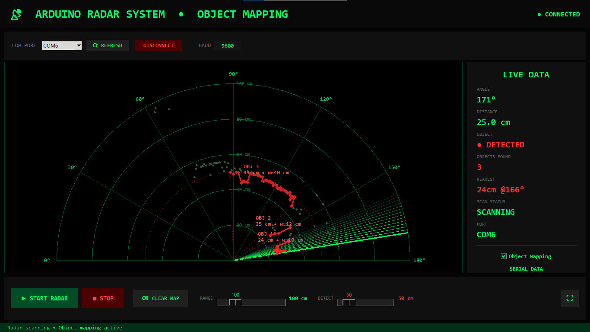
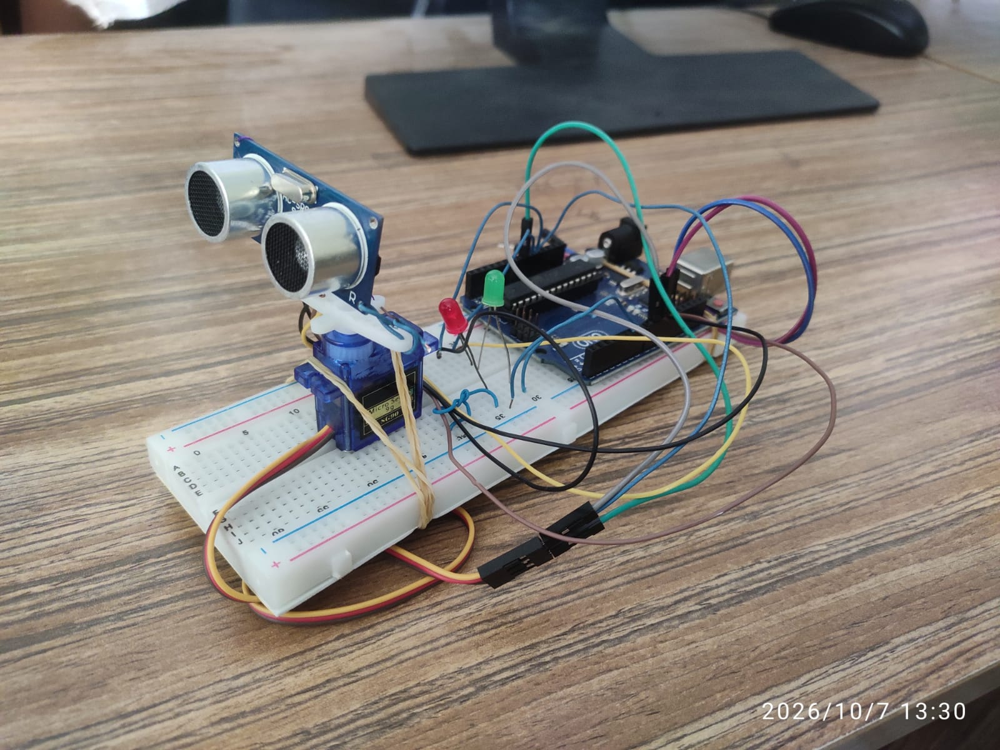
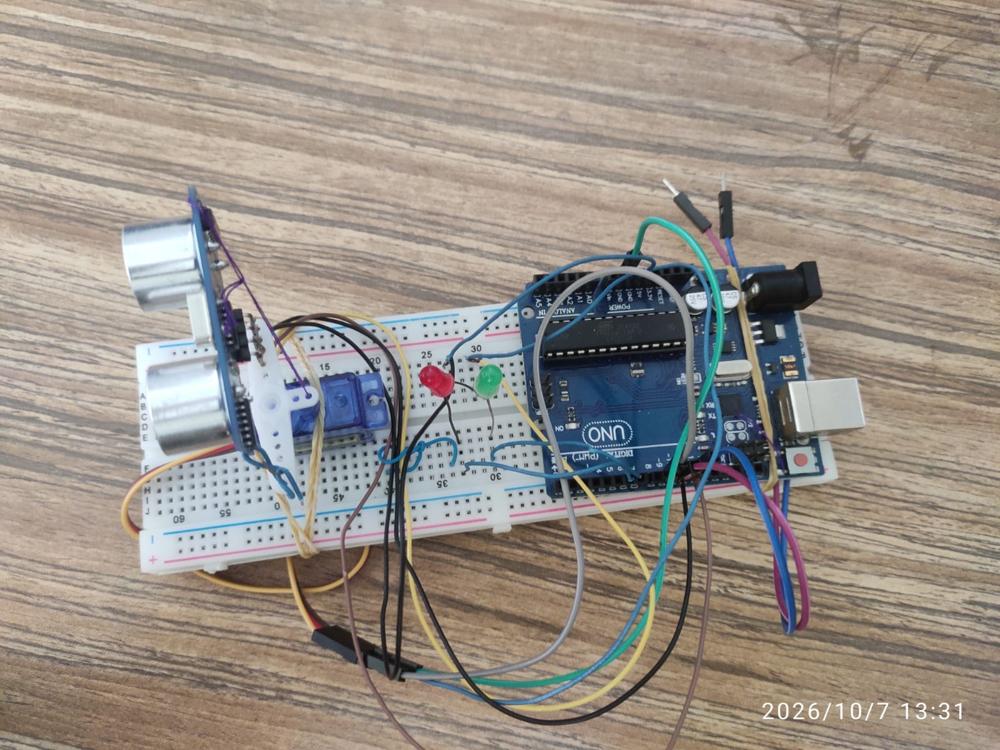
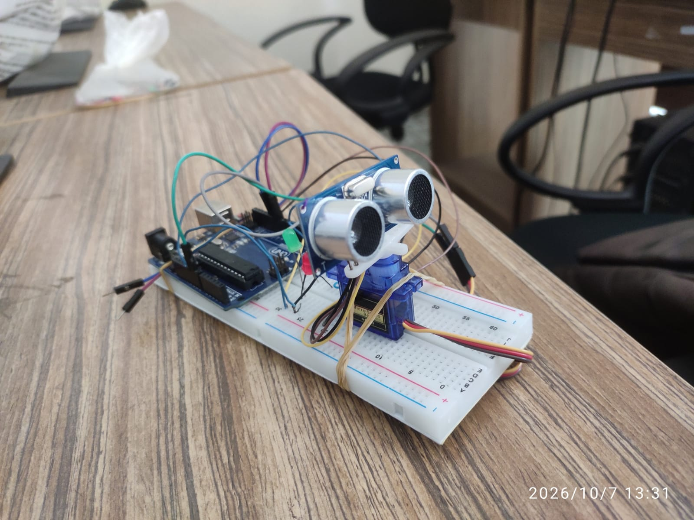
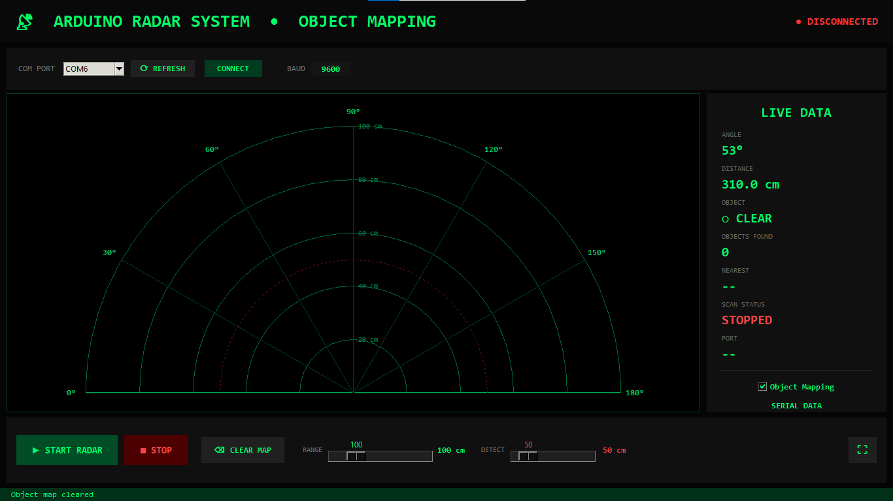

# 📡 Arduino Radar System — Object Mapping

A real-time ultrasonic radar built with an **Arduino UNO**, an **HC-SR04** ultrasonic sensor
swept across 180° by an **SG90 servo**, paired with a **Python / Tkinter desktop GUI** that
draws the sweep live, clusters echoes into objects, and labels each object with its distance
and estimated width.



---

## 🎓 Academic Project

Developed as an academic project at the
**Department of Computer Science and Engineering**,
**EXIM Bank Agricultural University Bangladesh (EBAUB)**, Chapainawabganj, Bangladesh.

| | |
| --- | --- |
| **Project idea & supervision** | Md. Ebrahim Hossen — Lecturer, Dept of CSE, EBAUB |
| **Developed by** | Md. Makshedul Islam — 2nd Year Student, Dept. of CSE, EBAUB |
| **Institution** | EXIM Bank Agricultural University Bangladesh (EBAUB) |
| **Year** | 2026 |

---

## ✨ Features

- **Live 0–180° radar sweep** with a fading beam trail on a polar grid
- **Object mapping** — neighbouring echo points are clustered into objects, drawn as outlines
  and labelled with nearest distance and estimated width (`OBJ n • d cm • w≈x cm`)
- **Adjustable range & detection zone** — RANGE slider (20–400 cm) and DETECT slider
  (5–400 cm); the detection limit is drawn as a dashed red ring
- **Live data panel** — angle, distance, DETECTED/CLEAR state, object count, nearest object,
  scan status and raw serial log
- **Hardware status LEDs** — red when an object is inside the detection zone, green when clear
- **Serial control protocol** — `START` / `STOP` / `SPEED:nn` commands sent from the GUI

---

## 🧰 Hardware

| Item                          | Qty |
| ----------------------------- | --- |
| Arduino UNO                   | 1   |
| HC-SR04 ultrasonic sensor     | 1   |
| SG90 micro servo              | 1   |
| Red LED                       | 1   |
| Green LED                     | 1   |
| 220 Ω resistor (for each LED) | 2   |
| Breadboard + jumper wires     | 1 set |

### Wiring

| Component            | Arduino UNO pin |
| -------------------- | --------------- |
| Servo signal (SG90)  | D9              |
| HC-SR04 **TRIG**     | D10             |
| HC-SR04 **ECHO**     | D11             |
| Green LED (via 220 Ω)| D6              |
| Red LED (via 220 Ω)  | D7              |
| Sensor / servo VCC   | 5V              |
| Sensor / servo / LED GND | GND         |

### Build photos

| | |
| :---: | :---: |
|  |  |
|  | *HC-SR04 mounted on the SG90 servo, UNO on breadboard* |

---

## 💻 Software Setup

### 1. Flash the Arduino

1. Open [`arduino/radar_sketch.ino`](arduino/radar_sketch.ino) in the Arduino IDE.
2. Select your board (Arduino UNO) and port, then upload.
3. The sketch idles at 9600 baud and waits for commands; the servo parks at 90°.

### 2. Run the Python GUI

Requires **Python 3** with Tkinter (included with Python on Windows) and **pyserial**:

```bash
pip install -r requirements.txt
python radar_gui.py
```

Then:

1. Pick the Arduino's COM port and press **CONNECT** (the board resets when the port
   opens — the app waits ~2 s for it).
2. Press **▶ START RADAR** — the servo begins sweeping and the GUI starts plotting.
3. Tune **RANGE** and **DETECT** with the sliders; toggle **Object Mapping** or press
   **⌫ CLEAR MAP** at any time.

### GUI screenshots

| | |
| :---: | :---: |
|  |  |
| *Idle — grid, detection ring, controls* | *Scanning — beam trail, echoes, 3 mapped objects* |

---

## 🔌 Serial Protocol

**9600 baud, 8N1, ASCII.**

**Board → PC** (one line per measurement):

```
angle,distance
```

e.g. `90,24` — angle in degrees (0–180), distance in cm (`400` = no echo / out of range).

**PC → Board** (newline-terminated commands):

| Command      | Effect                                   |
| ------------ | ---------------------------------------- |
| `START`      | Begin sweeping and streaming readings    |
| `STOP`       | Stop, park servo at 90°, LEDs off        |
| `SPEED:30`   | Servo step delay in ms (10–200)          |

---

## 🧠 How the Object Mapping Works

1. **Binning** — each reading is stored in a 1° angular bin; a "no echo" reading clears
   that bin so stale ghosts disappear.
2. **Expiry** — points older than the sweep period are dropped. The GUI measures the
   servo's direction flips to learn the sweep period automatically.
3. **Clustering** — in-zone points (inside the DETECT limit) are sorted by angle and
   grouped while the angular gap ≤ 4° and the distance jump between neighbours is
   ≤ max(10 cm, 20 % of the distance).
4. **Filtering** — groups with fewer than 3 points are treated as noise.
5. **Labelling** — each object reports its nearest point and an estimated width
   (straight-line distance between its two end points in real-world cm coordinates).

Tuning constants live at the top of [`radar_gui.py`](radar_gui.py)
(`MIN_OBJECT_POINTS`, `MAX_GAP_DEG`, `JUMP_ABS_CM`, `JUMP_REL`, ...).

---

## 🗂 Project Structure

```
arduino-radar-system/
├── arduino/
│   └── radar_sketch.ino   # Firmware: servo sweep, HC-SR04 ranging, LEDs, serial
├── images/                # GUI screenshots + hardware photos
├── radar_gui.py           # Python Tkinter radar GUI with object mapping
├── requirements.txt       # pyserial
├── LICENSE
└── README.md
```

---

## 🛠 Troubleshooting

| Symptom | Fix |
| ------- | --- |
| No ports listed | Check the USB cable, install the UNO driver (CH340 / ATmega16U2), press **⟳ REFRESH** |
| `Connection Error` | Another app (Serial Monitor, Arduino IDE) is holding the port — close it |
| Distance always 400 | Check TRIG/ECHO wiring; make sure the sensor is powered from 5V |
| Servo jitters / brown-out | Power the servo from 5V with a solid GND; avoid powering it from a breadboard rail shared with long loose wires |
| Objects flicker | Raise `MIN_LIFETIME` or lower `servoDelay` so each pass refreshes bins faster |

---

## 🙏 Acknowledgements

This project was developed on an idea proposed by **Md. Ebrahim Hossen**,
Lecturer, Department of Computer Science and Engineering,
EXIM Bank Agricultural University Bangladesh (EBAUB), and completed under his
supervision. Sincere thanks to him for the guidance, encouragement and feedback
throughout the work, and to EBAUB for the academic environment that made this
project possible.

---

## 📄 License

MIT — see [LICENSE](LICENSE).
